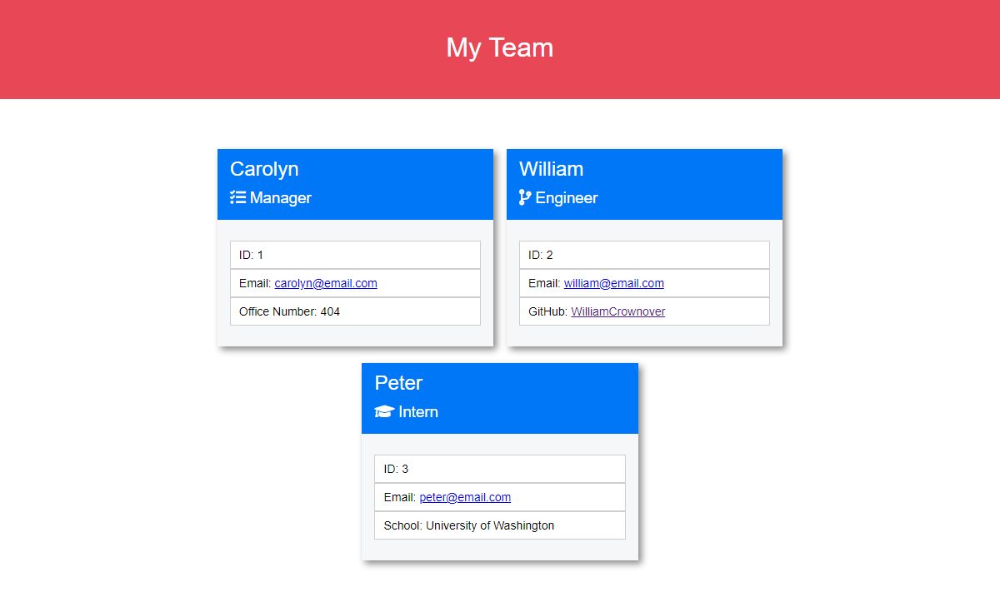

# Team Profile Generator

## Description

## Walkthrough Video

https://www.youtube.com/watch?v=AtOq2hcFxUg&ab_channel=WilliamCrownover

## Example Generated HTML Webpage

https://drive.google.com/file/d/1hipiAClXWToMrqqvo1sXyjSBqbFqUZ9e/view?usp=sharing

## Installation

You will need Node.js installed on your local machine to run this app.
Then you can clone this repo to your local machine.
You can then run it in VSCode and open an integrated terminal of the root folder.
Before use, run `npm install` to load any dependencies such as Inquirer to the folder.

## Usage

After proper installation, the app can be run using `node index.js` in the command line.
You will first be asked for the team manager’s information.
After that you can add infinite numbers of engineers and interns by filling out requested information per team member.
When ready to generate the file you will select ‘Finished’ for the next team member and the webpage html and css files will be generated to the “dist” folder.

## Tests

This application has four sets of tests for the class objects. To run the tests in VSCode use `npm run test` in an integrated terminal.
